# 🎓 NZCEL Exam Prep - AI-Powered Interactive Learning Platform

<div align="center">

[](https://nextjs.org/)
[](https://www.typescriptlang.org/)
[](https://copilotkit.ai/)
[](https://tailwindcss.com/)
[](LICENSE)

An innovative, gamified web application that revolutionizes NZCEL exam preparation through AI-powered adaptive learning, real-time feedback, and engaging interactive experiences.

[Features](#-features) • [Architecture](#-architecture) • [Getting Started](#-getting-started) • [Tech Stack](#-tech-stack) • [Documentation](#-documentation)

</div>

---

## 📋 Table of Contents

- [Overview](#-overview)
- [Features](#-features)
- [System Architecture](#-system-architecture)
- [Technology Stack](#-tech-stack)
- [Getting Started](#-getting-started)
- [Project Structure](#-project-structure)
- [CopilotKit Integration](#-copilotkit-integration)
- [NZCEL Framework](#-nzcel-framework)
- [User Flow](#-user-flow)
- [Data Models](#-data-models)
- [Contributing](#-contributing)
- [License](#-license)

---

## 🌟 Overview

The **NZCEL Exam Prep Platform** is a comprehensive learning solution designed to help students master the New Zealand Certificates in English Language (NZCEL) examinations. By combining artificial intelligence, gamification, and modern web technologies, we provide an engaging and effective study experience.

### Key Highlights

- 🤖 **AI-Powered Study Companion** - Intelligent tutoring with CopilotKit
- 🎯 **Adaptive Learning** - Personalized difficulty adjustment
- 🏆 **Gamification** - Points, badges, streaks, and achievements
- 📊 **Progress Tracking** - Real-time skill monitoring
- ✨ **Modern UI/UX** - Beautiful animations and responsive design
- 🌐 **Client-Side First** - No backend required, data persists locally

---

## ✨ Features

### 🤖 AI-Powered Learning

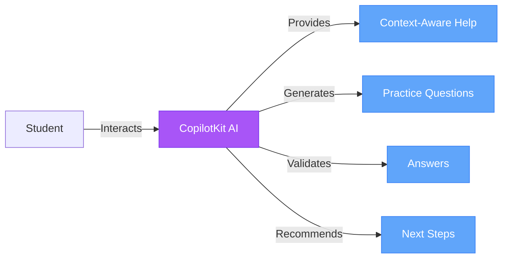

**AI Capabilities:**
- Generate contextual practice questions based on student level
- Provide instant answer validation with detailed explanations
- Recommend personalized learning paths based on performance
- Explain NZCEL framework concepts and requirements
- Award achievements and badges for milestones
- Track and update skill progress dynamically

### 🎯 Adaptive Practice System

- **13 NZCEL Levels**: Foundation → Level 1 → Level 2 → Level 3 (General/Applied/Academic) → Level 4 (General/Employment/Academic) → Level 5 (General/Employment/Academic) → Level 6 (Advanced)
- **4 Core Skills**: Listening 🎧, Speaking 🗣️, Reading 📖, Writing ✍️
- **Multiple Question Types**: Multiple Choice, Fill-in-Blank, Essays, Speaking Prompts
- **Smart Difficulty Adjustment**: AI-driven level recommendations

### 🏆 Gamification System

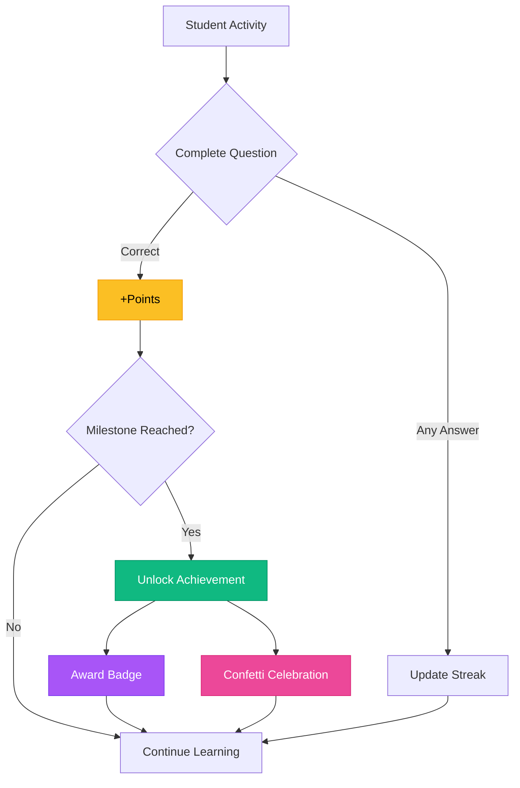

**Gamification Elements:**
- ⭐ **Points System**: Earn points for every correct answer
- 🔥 **Study Streaks**: Maintain daily practice momentum
- 🏅 **Achievements**: 6 progressive milestones to unlock
- 🎖️ **Badges**: Collectible rewards with rarity tiers
- 🎉 **Celebrations**: Confetti animations for major wins

### 📊 Progress Dashboard

- Real-time skill progress visualization
- Comprehensive statistics (points, streak, questions completed)
- Achievement tracking (in-progress vs. completed)
- Badge showcase and collection
- Study calendar with streak history

---

## 🏗️ System Architecture

### High-Level Architecture

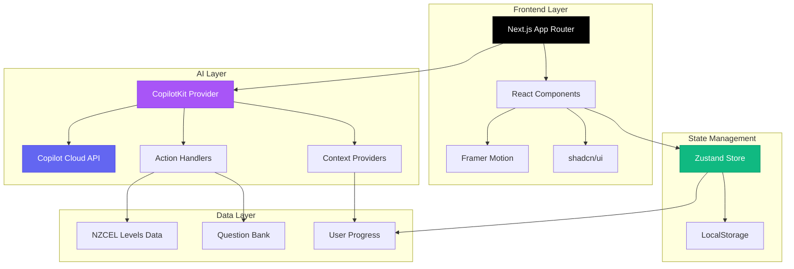

### Component Architecture

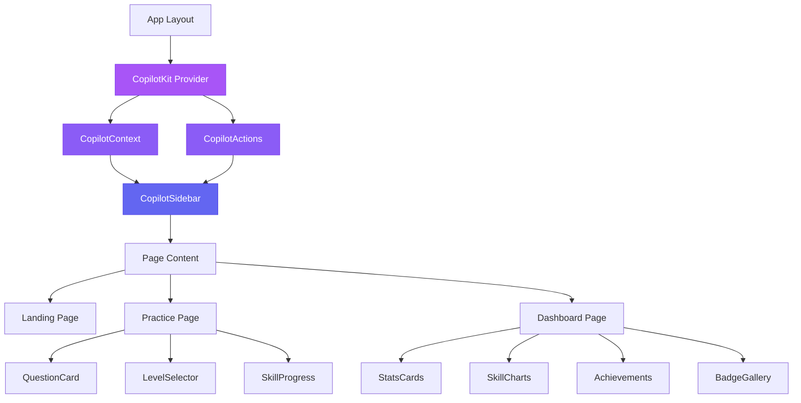

### Data Flow Architecture

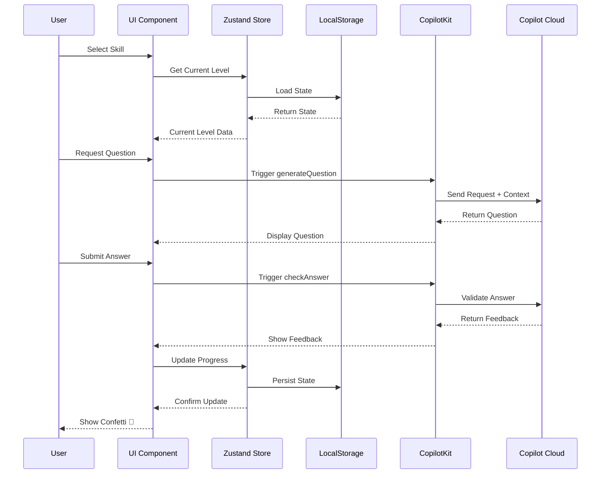

---

## 🛠️ Tech Stack

### Core Technologies

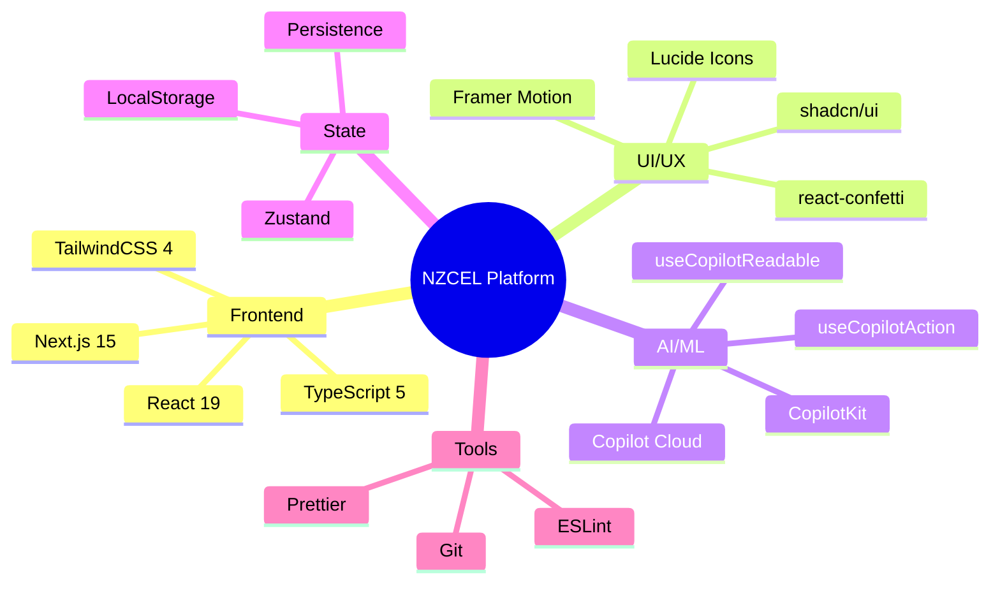

### Technology Details

| Category | Technology | Purpose |
|----------|-----------|---------|
| **Framework** | Next.js 15 | App Router, RSC, TypeScript support |
| **UI Library** | React 19 | Component-based architecture |
| **Styling** | TailwindCSS 4 | Utility-first CSS framework |
| **Components** | shadcn/ui | Beautiful, accessible components |
| **AI Platform** | CopilotKit | AI integration framework |
| **AI Backend** | Copilot Cloud | Managed AI service |
| **State Mgmt** | Zustand | Lightweight state management |
| **Persistence** | LocalStorage | Client-side data storage |
| **Animations** | Framer Motion | Smooth, declarative animations |
| **Icons** | Lucide React | Modern icon system |
| **Language** | TypeScript | Type safety and developer experience |

---

## 🚀 Getting Started

### Prerequisites

- **Node.js**: 18.0 or higher
- **npm**: 9.0 or higher (or yarn/pnpm)
- **Git**: For version control

### Installation

```bash
# Clone the repository
git clone <repository-url>
cd nzcel-prep

# Install dependencies
npm install

# Start development server
npm run dev
```

### Development

The application will be available at:
- **Local**: http://localhost:3000
- **Network**: http://your-ip:3000

### Build for Production

```bash
# Create optimized production build
npm run build

# Start production server
npm start
```

### Linting

```bash
# Run ESLint
npm run lint
```

---

## 📁 Project Structure

```
nzcel-prep/
├── src/
│   ├── app/                          # Next.js App Router
│   │   ├── layout.tsx               # Root layout with providers
│   │   ├── page.tsx                 # Landing page
│   │   ├── practice/                # Practice interface
│   │   │   └── page.tsx
│   │   └── dashboard/               # Progress dashboard
│   │       └── page.tsx
│   │
│   ├── components/
│   │   ├── ui/                      # shadcn/ui components
│   │   │   ├── button.tsx
│   │   │   ├── card.tsx
│   │   │   ├── badge.tsx
│   │   │   └── ... (14 components)
│   │   │
│   │   ├── copilot/                 # CopilotKit integration
│   │   │   ├── copilot-context.tsx  # useCopilotReadable
│   │   │   └── copilot-actions.tsx  # useCopilotAction
│   │   │
│   │   ├── practice/                # Practice components
│   │   │   ├── question-card.tsx
│   │   │   └── level-selector.tsx
│   │   │
│   │   └── providers.tsx            # App providers wrapper
│   │
│   ├── data/
│   │   ├── nzcel-levels.ts          # 13 NZCEL level definitions
│   │   └── questions.ts             # Question bank & helpers
│   │
│   ├── lib/
│   │   ├── store/
│   │   │   └── user-progress.ts     # Zustand store
│   │   └── utils.ts                 # Utility functions
│   │
│   ├── types/
│   │   └── index.ts                 # TypeScript definitions
│   │
│   └── hooks/
│       └── use-window-size.ts       # Custom React hooks
│
├── public/                          # Static assets
├── package.json                     # Dependencies
├── tsconfig.json                    # TypeScript config
├── tailwind.config.ts              # Tailwind config
├── next.config.ts                  # Next.js config
└── README.md                        # This file
```

---

## 🤖 CopilotKit Integration

### Architecture Overview

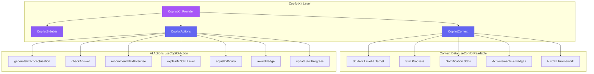

### Context Providers (useCopilotReadable)

The AI has access to comprehensive student context:

```typescript
// Current level and goals
{
  currentLevel: "level-4-academic",
  targetLevel: "level-5-academic"
}

// Skill progress (0-100%)
{
  listening: 75,
  speaking: 60,
  reading: 85,
  writing: 70
}

// Gamification metrics
{
  totalPoints: 1250,
  streak: 7,
  completedQuestionsCount: 45,
  lastStudyDate: "2025-10-18"
}

// Achievements & Badges
{
  achievements: [...],
  badges: [...]
}

// Complete NZCEL Framework
{
  levels: [13 levels with full details]
}
```

### AI Actions (useCopilotAction)

| Action | Purpose | Parameters | Returns |
|--------|---------|------------|---------|
| `generatePracticeQuestion` | Create contextual practice questions | level, skill | Question object |
| `checkAnswer` | Validate student answers | questionId, userAnswer | Feedback, points |
| `recommendNextExercise` | Suggest adaptive learning path | - | Recommended skill, question |
| `explainNZCELLevel` | Provide level details | level | Level information |
| `adjustDifficulty` | Change student level | newLevel, reason | Confirmation |
| `awardBadge` | Grant achievement badges | badgeName, reason, rarity | Badge object |
| `updateSkillProgress` | Track skill improvement | skill, progressChange | New progress |

### Example AI Interactions

**Student**: "Can you generate a reading question for Level 4 Academic?"

**AI**: *Executes `generatePracticeQuestion` action*
```json
{
  "success": true,
  "question": {
    "type": "multiple-choice",
    "question": "Read: 'Climate change presents...' What is the main topic?",
    "options": [...],
    "points": 40
  }
}
```

**Student**: "What's the difference between Level 3 and Level 4?"

**AI**: *Executes `explainNZCELLevel` action twice and compares*

---

## 📚 NZCEL Framework

### Level Progression

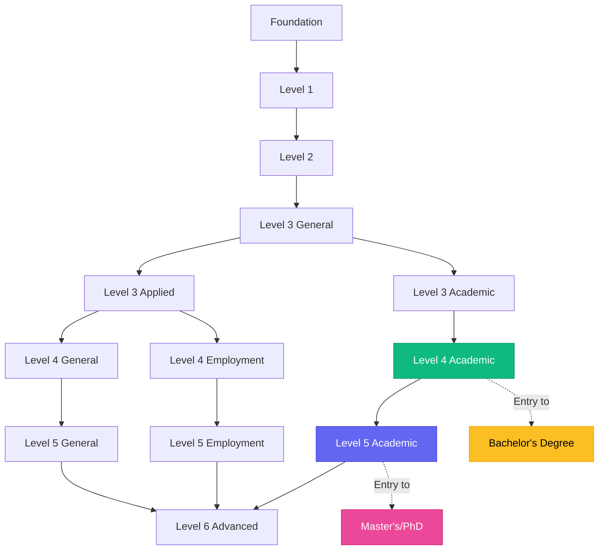

### IELTS Equivalency

| NZCEL Level | IELTS Score | TOEFL iBT | PTE Academic | CEFR | Pathway |
|-------------|-------------|-----------|--------------|------|---------|
| Level 3 (Applied/Academic) | 5.5 (no band < 5.0) | 46 | 42 | - | Certificate Level 4 |
| Level 4 (General/Employment) | 5.5 (no band < 5.0) | 46 | 42 | - | Diploma Level 5 |
| **Level 4 (Academic)** | **6.0 (no band < 5.5)** | **60** | **50** | **B2** | **Bachelor's Degree** |
| **Level 5 (Academic)** | **6.5 (no band < 6.0)** | **79** | **58** | **C1** | **Master's/PhD** |
| Level 6 (Advanced) | - | - | - | C2 | Advanced proficiency |

### Four Core Skills

Each NZCEL level defines graduate outcomes for:

1. **🎧 Listening**: Understanding spoken English in various contexts
2. **🗣️ Speaking**: Participating in conversations and presentations
3. **📖 Reading**: Comprehending written texts and materials
4. **✍️ Writing**: Producing clear, structured written communication

---

## 👥 User Flow

### Student Journey

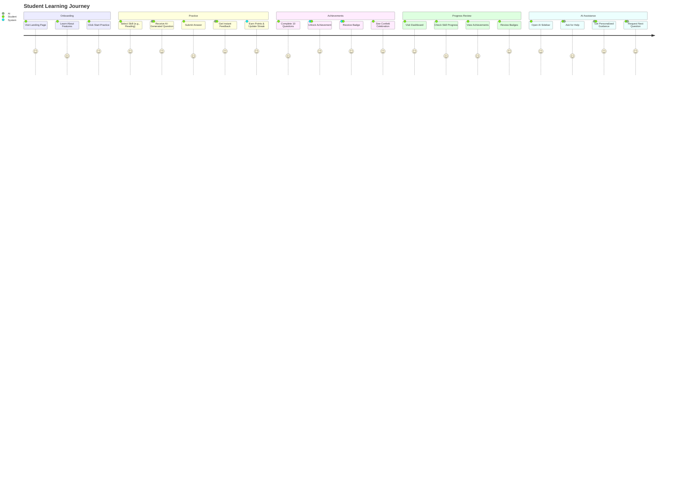

### Practice Flow

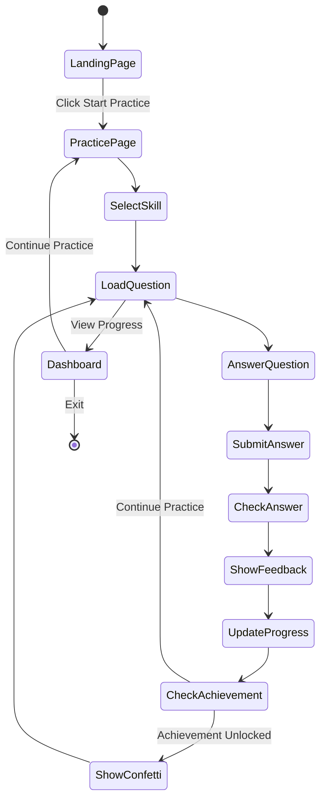

---

## 🗄️ Data Models

### TypeScript Type Definitions

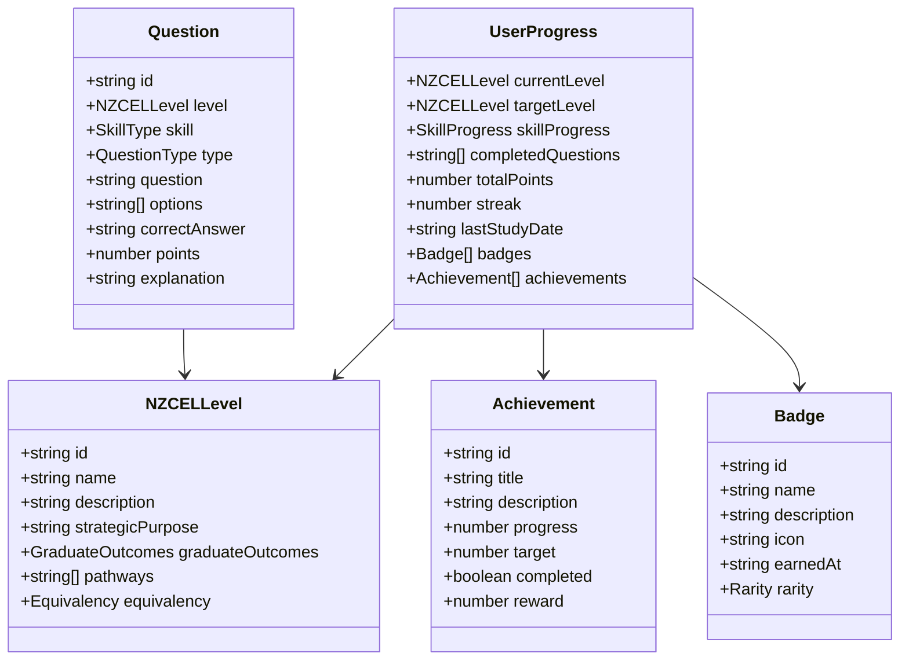

---

## 🤝 Contributing

We welcome contributions! Here's how you can help:

### Development Workflow

1. **Fork the repository**
2. **Create a feature branch**: `git checkout -b feature/amazing-feature`
3. **Commit your changes**: `git commit -m 'Add amazing feature'`
4. **Push to the branch**: `git push origin feature/amazing-feature`
5. **Open a Pull Request**

### Code Style

- Follow TypeScript best practices
- Use ESLint configuration provided
- Write meaningful commit messages
- Add comments for complex logic
- Ensure responsive design

### Adding Questions

To expand the question bank:

1. Edit `src/data/questions.ts`
2. Follow the `Question` interface structure
3. Include explanation for correct answers
4. Test questions in practice mode

---

## 📄 License

This project is licensed under the MIT License - see the [LICENSE](LICENSE) file for details.

---

## 🙏 Acknowledgments

- **NZQA** - For the comprehensive NZCEL framework
- **CopilotKit** - For enabling seamless AI integration
- **shadcn/ui** - For beautiful, accessible components
- **Vercel** - For the Next.js framework and hosting platform
- **NZCEL Students** - For inspiring this educational tool

---

## 📞 Support

For questions, issues, or suggestions:

- 📧 Email: support@nzcel-prep.com
- 🐛 Issues: [GitHub Issues](https://github.com/yourusername/nzcel-prep/issues)
- 💬 Discussions: [GitHub Discussions](https://github.com/yourusername/nzcel-prep/discussions)

---

<div align="center">

**Built with ❤️ for NZCEL students worldwide**

[](https://nextjs.org/)
[](https://copilotkit.ai/)

</div>
