# 🌍 AI-Powered ESOL Learning Platform

<div align="center">

[](https://nextjs.org/)
[](https://www.typescriptlang.org/)
[](https://copilotkit.ai/)
[](https://tailwindcss.com/)
[](https://vercel.com/)
[](LICENSE)

A comprehensive, AI-powered ESOL learning platform featuring **real-time voice conversation**, **CEFR-aligned practice**, **NZCEL exam prep**, and **multi-module progress tracking**. Built with Next.js 15, OpenAI Realtime API, CopilotKit, and Neon PostgreSQL.

[Features](#-features) • [Learning Paths](#-learning-paths) • [Architecture](#-architecture) • [Getting Started](#-getting-started) • [Tech Stack](#-tech-stack) • [Database](#-database) • [Documentation](#-documentation)

</div>

---

## 📋 Table of Contents

- [Overview](#-overview)
- [Features](#-features)
- [System Architecture](#-system-architecture)
- [Technology Stack](#-tech-stack)
- [Getting Started](#-getting-started)
- [Project Structure](#-project-structure)
- [CopilotKit Integration](#-copilotkit-integration)
- [NZCEL Framework](#-nzcel-framework)
- [User Flow](#-user-flow)
- [Data Models](#-data-models)
- [Contributing](#-contributing)
- [License](#-license)

---

## 🌟 Overview

The **AI-Powered ESOL Learning Platform** is a comprehensive solution for English language learners, offering multiple integrated learning paths. From real-time AI conversation practice to structured exam preparation, the platform combines cutting-edge AI technology with proven language learning methodologies.

### Key Highlights

- 🎤 **Real-Time AI Speaking Coach** - Natural voice conversations using OpenAI Realtime API (GA)
- 📚 **Multiple Learning Paths** - CEFR practice, NZCEL exam prep, scenario-based learning
- 🤖 **AI-Powered Study Companion** - Intelligent tutoring with CopilotKit
- 🎯 **Dual Progress Tracking** - Separate CEFR and NZCEL progress systems
- 🏆 **Gamification System** - Points, badges, streaks, and progressive achievements
- 📊 **Multi-Module Dashboard** - Unified view of progress across all learning paths
- 🗄️ **Full Database Integration** - Neon PostgreSQL with **44 tables** across 13 categories
- 🏢 **Multi-Tenant Architecture** - Complete organization-based data isolation with 60+ Server Actions
- 💾 **Intelligent Audio Caching** - 90%+ cost savings on TTS API calls
- 🔐 **Secure Authentication** - Stack Auth with route protection
- ☁️ **Cloud Storage** - Vercel Blob for audio files with CDN acceleration
- ✨ **Modern UI/UX** - Beautiful animations, theme switching, and responsive design
- 📈 **Complete Session Tracking** - Every practice session, recording, and conversation permanently stored
- 🏗️ **Clean Architecture** - Organized component structure with comprehensive placement guidelines

---

## ✨ Features

### 🤖 AI-Powered Learning

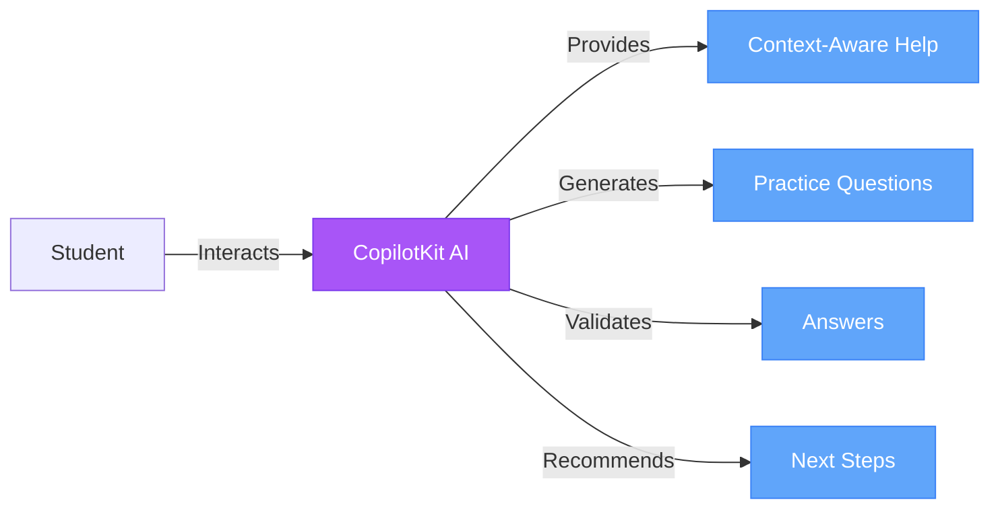

**AI Capabilities:**
- Generate contextual practice questions based on student level
- Provide instant answer validation with detailed explanations
- Recommend personalized learning paths based on performance
- Explain NZCEL framework concepts and requirements
- Award achievements and badges for milestones
- Track and update skill progress dynamically

### 🎯 Adaptive Practice System

- **13 NZCEL Levels**: Foundation → Level 1 → Level 2 → Level 3 (General/Applied/Academic) → Level 4 (General/Employment/Academic) → Level 5 (General/Employment/Academic) → Level 6 (Advanced)
- **4 Core Skills**: Listening 🎧, Speaking 🗣️, Reading 📖, Writing ✍️
- **Multiple Question Types**: Multiple Choice, Fill-in-Blank, Essays, Speaking Prompts
- **Smart Difficulty Adjustment**: AI-driven level recommendations

### 🏆 Gamification System

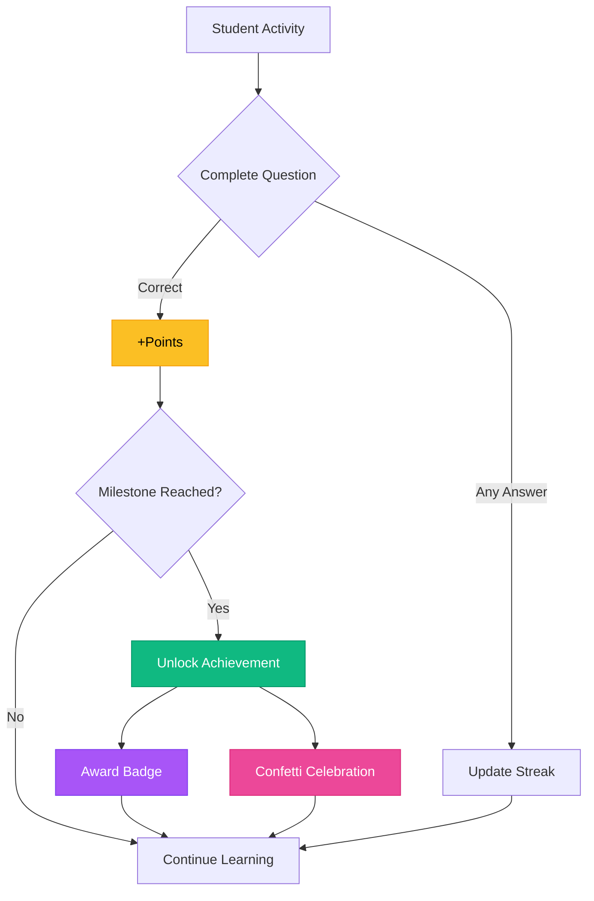

**Gamification Elements:**
- ⭐ **Points System**: Earn points for every correct answer
- 🔥 **Study Streaks**: Maintain daily practice momentum
- 🏅 **Achievements**: 6 progressive milestones to unlock
- 🎖️ **Badges**: Collectible rewards with rarity tiers
- 🎉 **Celebrations**: Confetti animations for major wins

### 📊 Multi-Module Progress Dashboard

- **Overview Tab**: Aggregated stats across all learning modules
- **NZCEL Tab**: Detailed NZCEL progress (13 levels, 4 skills)
- **General Practice Tab**: CEFR progress tracking (A1-C2)
- **Speaking Tab**: AI Speaking Coach statistics
- Real-time skill progress visualization
- Comprehensive statistics (points, streak, questions completed)
- Achievement tracking (in-progress vs. completed)
- Badge showcase and collection
- Study calendar with streak history

---

## 🚀 Learning Paths

The platform offers multiple integrated learning paths to suit different goals and preferences:

### 1. 🎤 AI Speaking Coach (Featured)

**Real-time voice conversation practice with AI-powered ESOL coach**

- Uses OpenAI Realtime API (GA) for natural two-way dialogue
- Automatic Voice Activity Detection (VAD) for seamless interaction
- Real-time transcription display
- Instant pronunciation and fluency feedback
- CEFR-aligned scenarios (A1-C2)
- Practice natural conversation flow without button clicks

**Route**: `/speaking`

### 2. 📚 General English Practice

**CEFR-aligned practice for all four skills**

- Six CEFR levels: A1 (Elementary) → A2 → B1 → B2 → C1 → C2 (Proficiency)
- Comprehensive skill coverage: Listening, Speaking, Reading, Writing
- Adaptive question difficulty
- Independent progress tracking
- Equivalent to IELTS, TOEFL, PTE, Duolingo English Test

**Route**: `/practice/general`

### 3. 🎓 NZCEL Exam Preparation

**Comprehensive prep for New Zealand Certificates in English Language**

- 13 NZCEL levels: Foundation → Level 1-6 (General/Applied/Academic/Employment)
- All four skills aligned with NZCEL graduate outcomes
- University pathway preparation (Level 4/5 Academic)
- Authentic exam-style questions
- Strategic purpose and pathway guidance

**Route**: `/practice/nzcel`

### 4. 🌍 Scenario-Based Learning (Coming Soon)

**Practice English in real-world contexts**

- Workplace communication
- Travel and hospitality
- Academic settings
- Social situations
- Business English

**Route**: `/practice/scenarios` *(In Development)*

### 5. 📝 IELTS/TOEFL Preparation (Planned)

**Targeted preparation for major English proficiency exams**

- Coming soon to complement existing learning paths

---

## 🏗️ System Architecture

### High-Level Architecture

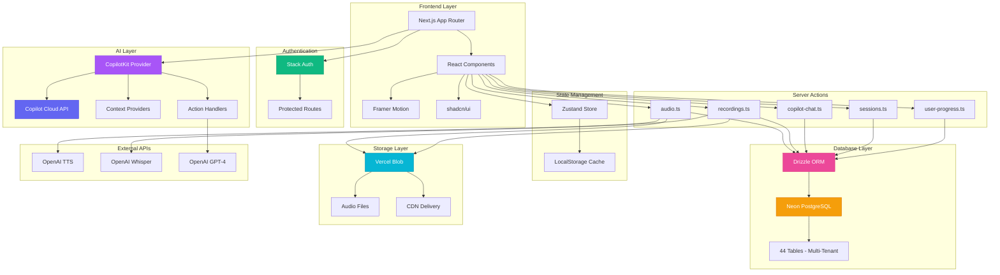

### Component Architecture

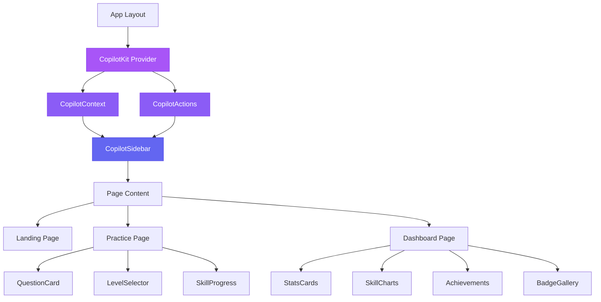

### Data Flow Architecture

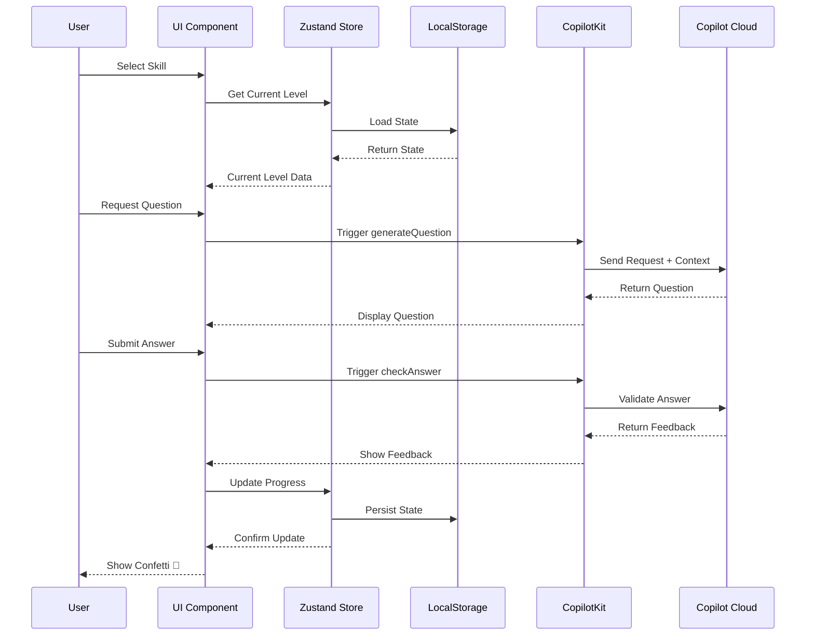

---

## 🛠️ Tech Stack

### Core Technologies

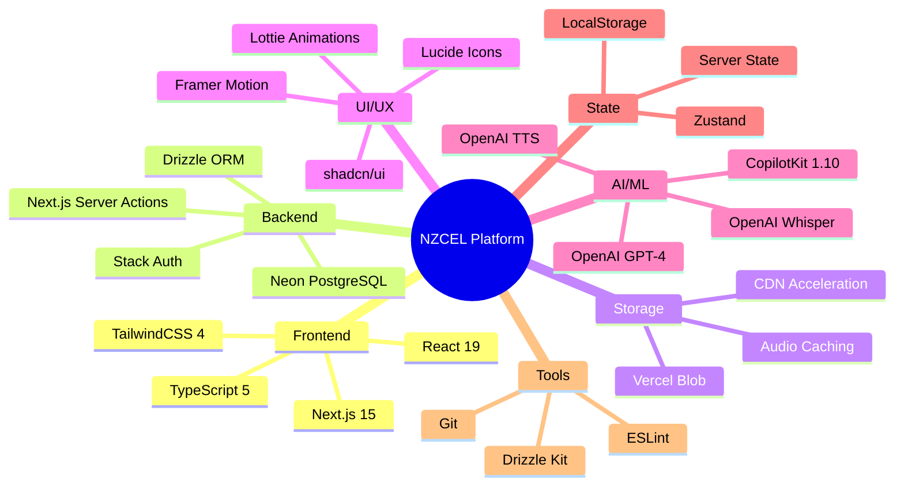

### Technology Details

| Category | Technology | Purpose |
|----------|-----------|---------|
| **Framework** | Next.js 15 | App Router, Server Actions, RSC, TypeScript support |
| **UI Library** | React 19 | Component-based architecture |
| **Styling** | TailwindCSS 4 | Utility-first CSS framework |
| **Components** | shadcn/ui | Beautiful, accessible Radix UI components |
| **AI Platform** | CopilotKit 1.10 | AI integration framework |
| **AI Services** | OpenAI APIs | TTS, Whisper, GPT-4 for audio and chat |
| **Database** | Neon PostgreSQL | Serverless PostgreSQL database |
| **ORM** | Drizzle ORM 0.44 | Type-safe database queries |
| **Authentication** | Stack Auth 2.8 | User authentication and session management |
| **File Storage** | Vercel Blob 2.0 | CDN-accelerated audio file storage |
| **State Mgmt** | Zustand | Lightweight client state management |
| **Cache** | LocalStorage | Client-side caching for performance |
| **Animations** | Framer Motion | Smooth, declarative animations |
| **Icons** | Lucide React | Modern icon system |
| **Language** | TypeScript 5 | Type safety and developer experience |

---

## 🚀 Getting Started

### Prerequisites

- **Node.js**: 18.0 or higher
- **npm**: 9.0 or higher (or yarn/pnpm)
- **Git**: For version control
- **Neon PostgreSQL Account**: Create at [neon.tech](https://neon.tech)
- **Stack Auth Account**: Create at [stack-auth.com](https://stack-auth.com)
- **Vercel Account**: For Blob storage (optional for development)
- **OpenAI API Key**: For TTS, Whisper, and GPT-4

### Installation

```bash
# 1. Clone the repository
git clone <repository-url>
cd nzcel-prep

# 2. Install dependencies
npm install

# 3. Set up environment variables
cp .env.example .env.local

# Edit .env.local with your credentials:
# - DATABASE_URL (from Neon)
# - STACK_SECRET_SERVER_KEY (from Stack Auth)
# - NEXT_PUBLIC_STACK_PROJECT_ID (from Stack Auth)
# - NEXT_PUBLIC_STACK_PUBLISHABLE_CLIENT_KEY (from Stack Auth)
# - BLOB_READ_WRITE_TOKEN (from Vercel)
# - OPENAI_API_KEY (from OpenAI)

# 4. Push database schema
npm run drizzle:push

# 5. Start development server
npm run dev
```

### Development

The application will be available at:
- **Local**: http://localhost:3000
- **Network**: http://your-ip:3000

### Build for Production

```bash
# Create optimized production build
npm run build

# Start production server
npm start
```

### Linting

```bash
# Run ESLint
npm run lint
```

### Database Commands

```bash
# Generate migration files
npm run drizzle:generate

# Run migrations
npm run drizzle:migrate

# Push schema directly (development)
npm run drizzle:push
```

---

## 🗄️ Database

### Database Architecture

The platform uses **Neon PostgreSQL** (serverless) with **Drizzle ORM** for type-safe database queries. All database operations are performed through Next.js Server Actions with **multi-tenant support** and Stack Auth authentication.

**Multi-Tenant Features**:
- 🏢 Complete organization-based data isolation
- 🔒 All 44 tables include `organization_id` column
- ✅ 60+ Server Actions with automatic organization scoping
- 🛡️ Zero risk of cross-tenant data leakage


### Database Tables (44 Total - 13 Categories)

| Category | Tables | Purpose | Multi-Tenant |
|----------|--------|---------|--------------|
| **Organizations & User Management** (9) | `organizations`, `users`, `departments`, `grade_levels`, `classes`, `class_teachers`, `class_enrollments`, `student_groups`, `parent_student_relationships` | Multi-tenant infrastructure and user hierarchy | ✅ Core |
| **User Progress - NZCEL** (4) | `user_progress`, `completed_questions`, `badges`, `achievements` | Track NZCEL learning progress and gamification | ✅ |
| **User Progress - CEFR & Modules** (2) | `cefr_progress`, `module_progress` | Track CEFR progress and module statistics | ✅ |
| **CopilotKit Chat** (2) | `copilot_conversations`, `copilot_messages` | Persist AI chat history | ✅ |
| **Audio Management** (4) | `audio_files`, `question_audio_cache`, `user_recordings`, `transcriptions` | Manage audio files and TTS caching | ✅ |
| **Practice Sessions** (2) | `practice_sessions`, `session_answers` | Track practice sessions | ✅ |
| **Conversation Practice** (2) | `conversation_sessions`, `conversation_turns` | Track conversation practice | ✅ |
| **Diagnostic Testing** (6) | `diagnostic_tests`, `diagnostic_test_sections`, `diagnostic_test_questions`, `student_diagnostic_attempts`, `diagnostic_question_responses`, `student_diagnostic_results` | Standardized testing and assessments | ✅ |
| **Teacher Assignments** (4) | `assignments`, `assignment_targets`, `assignment_student_status`, `assignment_submissions` | Teacher assignment management | ✅ |
| **Teacher Insights & Analytics** (2) | `teacher_insights`, `class_analytics` | Automated insights and analytics | ✅ |
| **RBAC & Permissions** (2) | `role_permissions`, `user_permissions` | Role-based access control | ✅ |
| **Question Banks** (3) | `question_banks`, `question_bank_questions`, `organization_question_access` | Question bank management | ✅ |
| **Invitations & Registration** (2) | `invitation_codes`, `invitation_usages` | User invitations and onboarding | ✅ |

### Key Features

#### 🎯 Intelligent Audio Caching

The platform implements a sophisticated audio caching system to minimize OpenAI TTS API costs:

- **First request**: Generates audio → Uploads to Blob → Saves to database (2-3s)
- **Subsequent requests**: Returns cached URL from database (0.1s)
- **Cost savings**: 90%+ reduction in TTS API calls
- **Cache key**: Content hash of text + voice model + voice name

#### 📊 Complete Data Tracking

- **User recordings**: All voice answers permanently stored with transcriptions
- **Session analytics**: Every practice and conversation session tracked
- **Chat history**: Full CopilotKit conversation history persistence
- **Achievement progress**: Real-time tracking of all achievements

#### 🔐 Security & Privacy

- **Multi-tenant isolation**: Complete organization-based data separation (44 tables)
- **Stack Auth integration**: All Server Actions require authentication
- **Enhanced user system**: Links Stack Auth IDs to organizations
- **Automatic scoping**: All queries filtered by `organization_id`
- **User data isolation**: Queries scoped to both user and organization
- **Encrypted at rest**: Neon PostgreSQL with automatic encryption
- **Zero cross-tenant leakage**: Impossible to access data from other organizations

For detailed database schema documentation, see [DATABASE_ARCHITECTURE.md](DATABASE_ARCHITECTURE.md).

---

## 📁 Project Structure

```
nzcel-prep/
├── src/
│   ├── app/
│   │   ├── (main)/                  # Main route group
│   │   │   ├── page.tsx            # Landing page (Multi-path entry)
│   │   │   ├── speaking/           # AI Speaking Coach ✨
│   │   │   ├── practice/
│   │   │   │   ├── general/        # CEFR-aligned practice ✨
│   │   │   │   ├── nzcel/          # NZCEL exam prep ✨
│   │   │   │   └── scenarios/      # Scenario learning (coming soon)
│   │   │   ├── conversation/       # Voice conversation (redirect)
│   │   │   ├── diagnostic/         # Diagnostic testing ✨
│   │   │   └── test-realtime/      # Realtime API debug
│   │   ├── (dashboards)/            # Role-based dashboards ✨
│   │   │   ├── student/dashboard/  # Student dashboard
│   │   │   ├── teacher/dashboard/  # Teacher dashboard
│   │   │   ├── parent/dashboard/   # Parent dashboard
│   │   │   ├── school-admin/       # School admin dashboard
│   │   │   ├── department/         # Department head dashboard
│   │   │   └── system-admin/       # System admin dashboard
│   │   ├── handler/[...stack]/     # Stack Auth routes
│   │   ├── api/openai/             # OpenAI API routes
│   │   │   ├── transcribe/         # Whisper STT
│   │   │   ├── assess/             # GPT-4 assessment
│   │   │   ├── tts/                # Text-to-speech
│   │   │   ├── conversation/       # Chat completions
│   │   │   └── realtime/           # Realtime API ✨
│   │   └── layout.tsx              # Root layout
│   │
│   ├── actions/                     # Server Actions (60+ functions, 19 files)
│   │   ├── audio.ts                # Audio caching & TTS
│   │   ├── recordings.ts           # User recordings
│   │   ├── copilot-chat.ts         # Chat history
│   │   ├── sessions.ts             # Session tracking
│   │   ├── user-progress.ts        # NZCEL progress & gamification
│   │   ├── cefr-progress.ts        # CEFR progress tracking ✨
│   │   ├── module-stats.ts         # Module statistics ✨
│   │   ├── diagnostics.ts          # Diagnostic tools ✨
│   │   ├── assignments.ts          # Teacher assignments ✨
│   │   ├── classes.ts              # Class management ✨
│   │   ├── teacher-insights.ts     # Teacher analytics ✨
│   │   ├── organizations.ts        # Organization management ✨
│   │   ├── users.ts                # User & role management ✨
│   │   ├── invitations.ts          # Invitation system ✨
│   │   └── [+ 5 more files]        # Auth, registration, utilities ✨
│   │
│   ├── lib/
│   │   ├── db/
│   │   │   ├── schema.ts           # Drizzle schema (44 tables, multi-tenant) ✨
│   │   │   └── index.ts            # fetchWithDrizzle helper (organization context)
│   │   ├── blob/
│   │   │   └── audio-storage.ts    # Vercel Blob utilities
│   │   ├── store/
│   │   │   ├── user-progress.ts    # NZCEL progress store
│   │   │   └── cefr-progress.ts    # CEFR progress store ✨
│   │   ├── stack.ts                # Stack Auth config
│   │   ├── openai.ts               # OpenAI client
│   │   └── utils.ts                # Utilities
│   │
│   ├── components/
│   │   ├── ui/                     # shadcn/ui primitives (DO NOT MODIFY)
│   │   ├── shared/                 # Shared across entire app
│   │   ├── copilot/                # CopilotKit integration
│   │   ├── practice/               # Practice module components
│   │   ├── conversation/           # Conversation module components
│   │   ├── speaking/               # AI Speaking Coach components ✨
│   │   ├── dashboard/              # Dashboard-specific widgets (self-contained) ✨
│   │   ├── charts/                 # Generic, reusable chart components
│   │   ├── audio/                  # General audio utilities
│   │   ├── navigation/             # Navigation components
│   │   ├── layout/                 # Layout components
│   │   ├── auth/                   # Authentication components
│   │   ├── filters/                # Filter components
│   │   ├── data-table/             # Data table components (TanStack Table)
│   │   ├── calendar/               # Calendar components
│   │   ├── spreadsheet/            # Spreadsheet components
│   │   └── providers.tsx           # App providers (includes ThemeProvider)
│   │
│   ├── data/
│   │   ├── nzcel-levels.ts         # 13 NZCEL levels
│   │   ├── questions.ts            # NZCEL question bank
│   │   ├── conversation-scenarios.ts # NZCEL scenarios
│   │   ├── cefr-levels.ts          # 6 CEFR levels ✨
│   │   ├── cefr-questions.ts       # CEFR question bank ✨
│   │   └── learning-modules.ts     # Module configuration ✨
│   │
│   ├── hooks/
│   │   ├── use-voice-recorder.ts   # Voice recording
│   │   ├── use-audio-playback.ts   # Audio playback
│   │   └── use-copilot-chat-history.ts # Chat persistence
│   │
│   └── types/
│       └── index.ts                # TypeScript definitions (LearningModule, etc.) ✨
│
├── drizzle/                        # Database migrations
├── public/                         # Static assets
│   ├── nzcel-prep-logo.svg
│   └── *.lottie                    # Lottie animations
├── .env.local                      # Environment variables
├── drizzle.config.ts               # Drizzle configuration
├── package.json                    # Dependencies
├── tsconfig.json                   # TypeScript config
├── tailwind.config.ts              # Tailwind config
├── next.config.ts                  # Next.js config
├── docs/
│   ├── COMPONENT_PLACEMENT_GUIDELINES.md  # Component organization rules ✨
│   ├── architecture/
│   │   ├── DATABASE_ARCHITECTURE.md       # Database documentation
│   │   └── DATABASE_SCHEMA_IMPLEMENTATION.md
│   └── guides/
│       └── STACK_AUTH_INTEGRATION.md      # Stack Auth guide
├── CLAUDE.md                              # Development guidelines
└── README.md                              # This file
```

---

## 🤖 CopilotKit Integration

### Architecture Overview

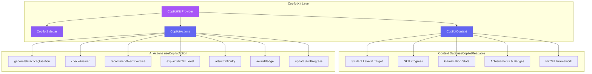

### Context Providers (useCopilotReadable)

The AI has access to comprehensive student context:

```typescript
// Current level and goals
{
  currentLevel: "level-4-academic",
  targetLevel: "level-5-academic"
}

// Skill progress (0-100%)
{
  listening: 75,
  speaking: 60,
  reading: 85,
  writing: 70
}

// Gamification metrics
{
  totalPoints: 1250,
  streak: 7,
  completedQuestionsCount: 45,
  lastStudyDate: "2025-10-18"
}

// Achievements & Badges
{
  achievements: [...],
  badges: [...]
}

// Complete NZCEL Framework
{
  levels: [13 levels with full details]
}
```

### AI Actions (useCopilotAction)

| Action | Purpose | Parameters | Returns |
|--------|---------|------------|---------|
| `generatePracticeQuestion` | Create contextual practice questions | level, skill | Question object |
| `checkAnswer` | Validate student answers | questionId, userAnswer | Feedback, points |
| `recommendNextExercise` | Suggest adaptive learning path | - | Recommended skill, question |
| `explainNZCELLevel` | Provide level details | level | Level information |
| `adjustDifficulty` | Change student level | newLevel, reason | Confirmation |
| `awardBadge` | Grant achievement badges | badgeName, reason, rarity | Badge object |
| `updateSkillProgress` | Track skill improvement | skill, progressChange | New progress |

### Example AI Interactions

**Student**: "Can you generate a reading question for Level 4 Academic?"

**AI**: *Executes `generatePracticeQuestion` action*
```json
{
  "success": true,
  "question": {
    "type": "multiple-choice",
    "question": "Read: 'Climate change presents...' What is the main topic?",
    "options": [...],
    "points": 40
  }
}
```

**Student**: "What's the difference between Level 3 and Level 4?"

**AI**: *Executes `explainNZCELLevel` action twice and compares*

---

## 📚 NZCEL Framework

### Level Progression

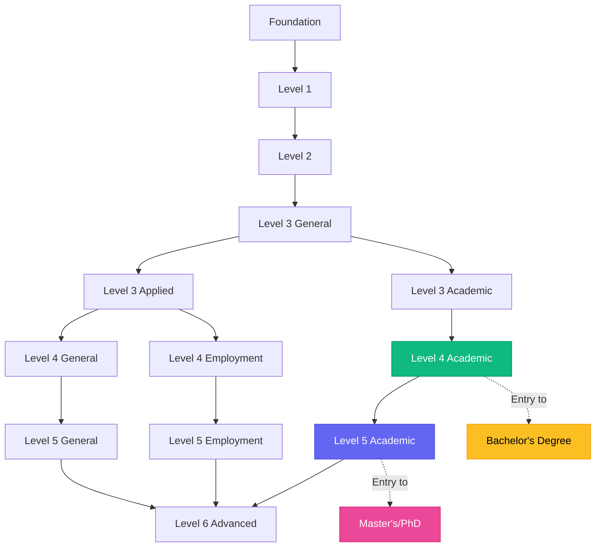

### IELTS Equivalency

| NZCEL Level | IELTS Score | TOEFL iBT | PTE Academic | CEFR | Pathway |
|-------------|-------------|-----------|--------------|------|---------|
| Level 3 (Applied/Academic) | 5.5 (no band < 5.0) | 46 | 42 | - | Certificate Level 4 |
| Level 4 (General/Employment) | 5.5 (no band < 5.0) | 46 | 42 | - | Diploma Level 5 |
| **Level 4 (Academic)** | **6.0 (no band < 5.5)** | **60** | **50** | **B2** | **Bachelor's Degree** |
| **Level 5 (Academic)** | **6.5 (no band < 6.0)** | **79** | **58** | **C1** | **Master's/PhD** |
| Level 6 (Advanced) | - | - | - | C2 | Advanced proficiency |

### Four Core Skills

Each NZCEL level defines graduate outcomes for:

1. **🎧 Listening**: Understanding spoken English in various contexts
2. **🗣️ Speaking**: Participating in conversations and presentations
3. **📖 Reading**: Comprehending written texts and materials
4. **✍️ Writing**: Producing clear, structured written communication

---

## 👥 User Flow

### Student Journey

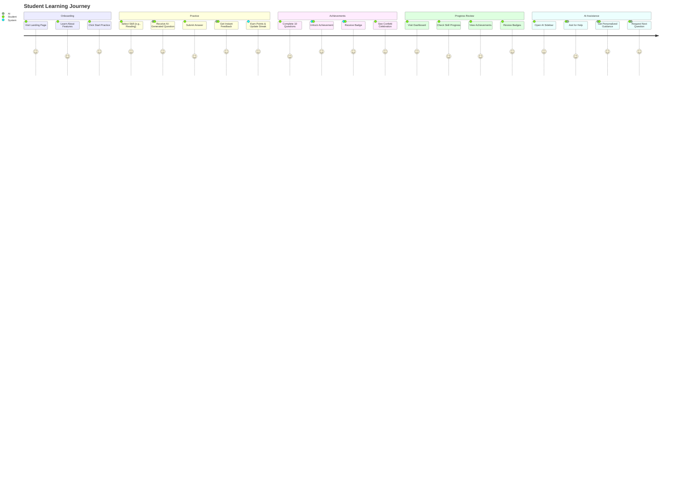

### Practice Flow

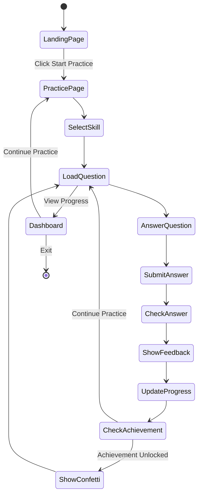

---

## 🗄️ Data Models

### TypeScript Type Definitions

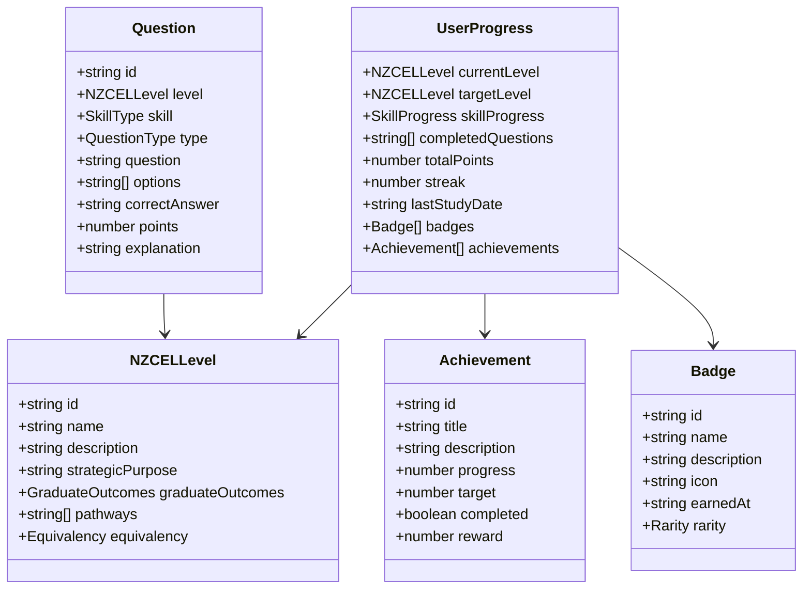

---

## 🤝 Contributing

We welcome contributions! Here's how you can help:

### Development Workflow

1. **Fork the repository**
2. **Create a feature branch**: `git checkout -b feature/amazing-feature`
3. **Commit your changes**: `git commit -m 'Add amazing feature'`
4. **Push to the branch**: `git push origin feature/amazing-feature`
5. **Open a Pull Request**

### Code Style

- Follow TypeScript best practices
- Use ESLint configuration provided
- Write meaningful commit messages
- Add comments for complex logic
- Ensure responsive design
- **Follow [Component Placement Guidelines](docs/COMPONENT_PLACEMENT_GUIDELINES.md)** when adding or moving components
- Never create version suffixes (`-v2`, `-new`, `-old`) - delete old code instead

### Adding Questions

To expand the question bank:

1. Edit `src/data/questions.ts`
2. Follow the `Question` interface structure
3. Include explanation for correct answers
4. Test questions in practice mode

---

## 📄 License

This project is licensed under the MIT License - see the [LICENSE](LICENSE) file for details.

---

## 📚 Documentation

Comprehensive documentation is available for developers and contributors:

### Architecture & Database
- **[DATABASE_ARCHITECTURE.md](docs/architecture/DATABASE_ARCHITECTURE.md)** - Complete database schema documentation with ERD diagrams, table definitions, Server Actions catalog, data flow architecture, and integration examples
- **[DATABASE_SCHEMA_IMPLEMENTATION.md](docs/architecture/DATABASE_SCHEMA_IMPLEMENTATION.md)** - Implementation guide with real-world integration examples and testing checklist

### Authentication & Integration
- **[STACK_AUTH_INTEGRATION.md](docs/guides/STACK_AUTH_INTEGRATION.md)** - Stack Auth setup guide, migration guide, and testing checklist

### Code Organization ✨
- **[COMPONENT_PLACEMENT_GUIDELINES.md](docs/COMPONENT_PLACEMENT_GUIDELINES.md)** - Component organization rules, decision trees, anti-patterns, and migration procedures to prevent duplication and maintain clean architecture

### Development
- **[CLAUDE.md](CLAUDE.md)** - Project guidelines for AI-assisted development with Claude Code
- **[README.md](README.md)** - This file (overview, features, getting started)

### Quick Links
- [Database Schema](/src/lib/db/schema.ts) - Drizzle ORM schema (44 tables, multi-tenant)
- [Server Actions](/src/actions/) - All database operations
- [API Routes](/src/app/api/openai/) - OpenAI integrations

---

## 🙏 Acknowledgments

- **NZQA** - For the comprehensive NZCEL framework
- **CopilotKit** - For enabling seamless AI integration
- **Stack Auth** - For secure authentication infrastructure
- **Neon** - For serverless PostgreSQL database
- **Vercel** - For Next.js framework, hosting, and Blob storage
- **OpenAI** - For TTS, Whisper, and GPT-4 APIs
- **shadcn/ui** - For beautiful, accessible components
- **NZCEL Students** - For inspiring this educational tool

---

## 📞 Support

For questions, issues, or suggestions:

- 📧 Email: support@nzcel-prep.com
- 🐛 Issues: [GitHub Issues](https://github.com/yourusername/nzcel-prep/issues)
- 💬 Discussions: [GitHub Discussions](https://github.com/yourusername/nzcel-prep/discussions)

---

<div align="center">

**Built with ❤️ for NZCEL students worldwide**

[](https://nextjs.org/)
[](https://copilotkit.ai/)

</div>

