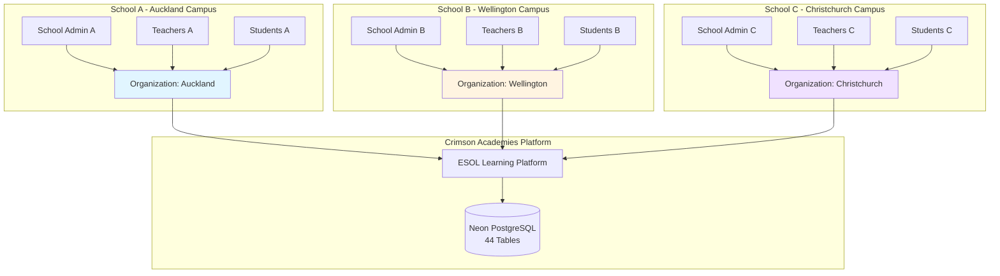
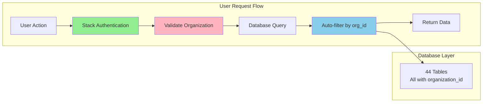
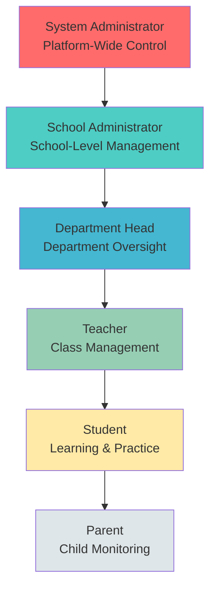
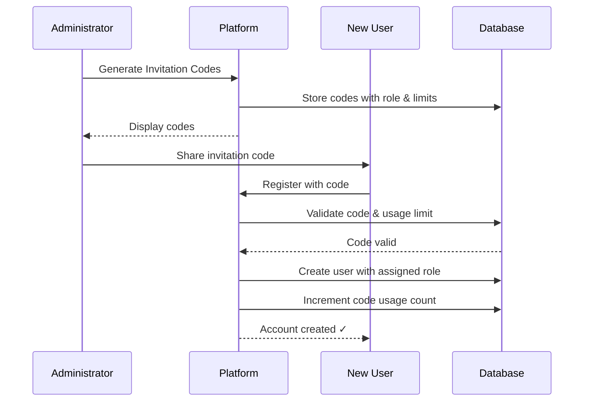
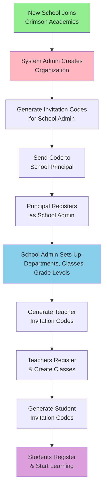
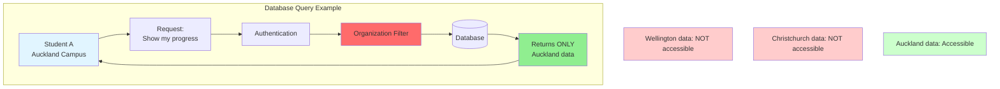

# ESOL Learning Platform - Executive Overview

## Document Purpose

This document provides a comprehensive overview of the AI-Powered ESOL (English for Speakers of Other Languages) Learning Platform developed for Crimson Academies. It outlines the platform's multi-tenant architecture, user role system, and how it supports multiple schools within the Crimson Academies network.

**Target Audience**: Crimson Academies CEO and Senior Leadership
**Last Updated**: October 27, 2025
**Platform Status**: Production-Ready with Multi-Tenant Architecture

---

## Executive Summary

The ESOL Learning Platform is a comprehensive web-based application designed to support English language learning across all Crimson Academies schools. Built with enterprise-grade technology and a robust multi-tenant architecture, the platform enables:

- **🏫 Multi-School Support**: Complete data isolation between different schools/campuses
- **👥 Role-Based Access Control**: Six distinct user roles with hierarchical permissions
- **🎓 Comprehensive Learning Paths**: NZCEL exam prep, CEFR-aligned practice, AI speaking coach, and more
- **🔒 Secure Registration System**: Invitation code-based user onboarding with role-specific access controls
- **📊 Advanced Analytics**: School-wide and classroom-level insights for administrators and teachers
- **🤖 AI Integration**: Real-time voice conversation, automated assessment, and personalized learning paths

---

## Platform Architecture

### Multi-Tenant Design

The platform implements a **shared database, organization-scoped** multi-tenant architecture, allowing multiple Crimson Academies schools to operate independently while sharing the same infrastructure.

### Key Architectural Benefits

1. **Complete Data Isolation**: Each school's data is completely isolated through organization-level filtering
2. **Shared Infrastructure**: All schools benefit from platform updates and new features simultaneously
3. **Cost Efficiency**: Single deployment serves multiple schools with minimal overhead
4. **Centralized Management**: System administrators can oversee all schools from a single dashboard
5. **Scalability**: Easy to onboard new schools without architectural changes

### Technical Implementation

**Database Schema**:
- **44 Tables** with organization-scoped data
- **60+ Server Actions** with automatic organization filtering
- **Neon PostgreSQL** serverless database with auto-scaling
- **Drizzle ORM** for type-safe database operations

---

## User Roles and Permissions

The platform supports **six distinct user roles** organized in a hierarchical permission structure:

### Role Capabilities

| Role | Key Capabilities | Scope |
|------|-----------------|-------|
| **System Administrator** | • Manage all organizations • Create invitation codes • Access all dashboards • System-wide analytics • User role management | Platform-wide |
| **School Administrator** | • Manage school users • Create classes and departments • Generate invitation codes • School-wide analytics • Assign teachers to classes | School-level |
| **Department Head** | • Oversee department teachers • Review department analytics • Manage curriculum standards • Coordinate assessments | Department-level |
| **Teacher** | • Create and assign tasks • Track student progress • Conduct diagnostic tests • Provide feedback • Manage classes | Class-level |
| **Student** | • Access learning modules • Complete assignments • Practice skills • Track personal progress • AI speaking coach | Individual |
| **Parent** | • Monitor child's progress • View assignments • Track learning analytics • Communicate with teachers | Child-level |

---

## Invitation Code System

To ensure controlled access and proper role assignment, the platform uses an **invitation code-based registration system**.

### How It Works

### Code Generation Rules

- **Role-Specific**: Each code is tied to a specific role
- **Usage Limits**: Configurable maximum uses per code
- **Organization-Scoped**: Codes automatically assign users to the correct school
- **Expiration**: Optional expiration dates for security
- **Tracking**: Full audit trail of code usage

### Test Account Invitation Codes

For the **Default System Organization**, the following invitation codes have been generated:

| Role | Invitation Code | Maximum Uses | Remaining Uses |
|------|----------------|--------------|----------------|
| System Admin | `SYSADMIN-85KL9P-X` | 5 | 4 |
| School Admin | `ADMIN-8B4AQH-T` | 10 | 9 |
| Department Head | `DEPTHEAD-XRPTFM-A` | 5 | 4 |
| Teacher | `TEACHER-DC469Q-Z` | 20 | 19 |
| Student | `STUDENT-7YAZAL-9` | Unlimited | ∞ |
| Parent | `PARENT-BWCZT8-N` | 50 | 49 |

---

## Test Accounts

For demonstration and testing purposes, the following accounts have been created under the **Default System Organization**:

### System Administrator
- **Email**: `sysadmin@test.com`
- **Password**: `Test1234!`
- **Access**: Platform-wide management capabilities
- **Use Case**: Platform administration, creating new schools, managing all users

### School Administrator
- **Email**: `admin@test.com`
- **Password**: `Test1234!`
- **Access**: School-level management for Default System Organization
- **Use Case**: Managing teachers, students, creating classes, school analytics

### Department Head
- **Email**: `depthead@test.com`
- **Password**: `Test1234!`
- **Access**: Department-level oversight, teacher and student monitoring
- **Use Case**: Managing department resources, reviewing teacher performance, monitoring student progress across department classes

### Teacher
- **Email**: `teacher@test.com`
- **Password**: `Test1234!`
- **Access**: Class management, assignment creation, student tracking
- **Use Case**: Creating assignments, tracking student progress, providing feedback

### Student
- **Email**: `student@test.com`
- **Password**: `Test1234!`
- **Access**: Learning modules, practice exercises, assignments
- **Use Case**: Practicing English skills, completing assignments, tracking progress

### Parent
- **Email**: `parent@test.com`
- **Password**: `Test1234!`
- **Access**: Child progress monitoring, assignment viewing
- **Use Case**: Monitoring child's learning progress, viewing completed work

> ⚠️ **Security Note**: These test accounts should only be used in development/staging environments. Production environments should use real credentials with strong password policies.

---

## Multi-School Application Scenarios

### Scenario 1: Onboarding a New School

**Timeline**: 1-2 days from organization creation to first student login

### Scenario 2: Daily Operations Across Multiple Schools

| Time | Auckland Campus | Wellington Campus | Christchurch Campus |
|------|----------------|-------------------|-------------------|
| 8:00 AM | 50 students begin morning practice | 45 students start assignments | 60 students access speaking coach |
| 10:00 AM | Teachers review progress dashboards | Department heads analyze class performance | School admin generates reports |
| 2:00 PM | Diagnostic tests administered | New students register with codes | Parents review child progress |
| 4:00 PM | Teachers assign homework | School admin invites new teachers | Students practice after school |

**Key Benefit**: All schools operate independently with complete data isolation, yet share the same platform infrastructure.

### Scenario 3: Data Isolation in Practice

**Security**: Every database query automatically filters by `organization_id`, ensuring students, teachers, and administrators can ONLY access data from their own school.

---

## Learning Modules

The platform offers multiple integrated learning paths suitable for all proficiency levels:

### Available Modules

1. **🎤 AI Speaking Coach** (OpenAI Realtime API)
   - Real-time voice conversation with AI
   - Natural two-way dialogue
   - Automatic pronunciation feedback

2. **📚 General English Practice** (CEFR A1-C2)
   - Aligned with Common European Framework
   - All four skills: Listening, Speaking, Reading, Writing
   - Adaptive difficulty

3. **🎓 NZCEL Exam Preparation** (Foundation - Level 6)
   - New Zealand Certificates in English Language
   - 13 comprehensive levels
   - Exam-specific strategies

4. **📊 Diagnostic Testing**
   - Placement tests for new students
   - Progress monitoring assessments
   - Skill gap analysis

5. **📝 Scenario-Based Learning** (Coming Soon)
   - Workplace, travel, and academic contexts
   - Real-world application

6. **🎯 IELTS/TOEFL Preparation** (Coming Soon)
   - Test-specific practice
   - Timed simulations

---

## Key Platform Features

### For School Administrators

- **User Management**: Create and manage teachers, students, and parents
- **Class Organization**: Set up departments, grade levels, and classes
- **Analytics Dashboard**: School-wide performance metrics
- **Invitation System**: Generate and distribute role-specific codes
- **Resource Allocation**: Monitor usage across classes

### For Teachers

- **Assignment Creation**: Create custom tasks for students
- **Progress Tracking**: Real-time student performance monitoring
- **Diagnostic Tools**: Assess student proficiency levels
- **Class Management**: Organize students into groups
- **Communication**: Provide feedback and guidance

### For Students

- **Adaptive Learning**: AI-powered personalized learning paths
- **Progress Tracking**: Visual dashboards showing skill development
- **Gamification**: Points, badges, achievements, and streaks
- **Voice Practice**: Real-time AI conversation and pronunciation feedback
- **Assignment Submission**: Complete and submit teacher-assigned work

### For Parents

- **Progress Monitoring**: Track child's learning journey
- **Assignment Visibility**: View completed and pending tasks
- **Performance Insights**: Understand strengths and areas for improvement
- **Communication**: Connect with teachers

---

## Technology Stack

| Layer | Technology | Purpose |
|-------|-----------|---------|
| **Frontend** | Next.js 15, React 19 | Modern web framework |
| **Backend** | Next.js Server Actions | API-free backend |
| **Database** | Neon PostgreSQL | Serverless, auto-scaling database |
| **ORM** | Drizzle | Type-safe database operations |
| **Authentication** | Stack Auth | User authentication & sessions |
| **Storage** | Vercel Blob | Audio file storage |
| **AI** | OpenAI (GPT-4, Whisper, TTS, Realtime API) | AI-powered features |
| **Hosting** | Vercel | Edge network deployment |

---

## Deployment and Scalability

### Current Infrastructure

- **Database**: Neon PostgreSQL (serverless, auto-scales)
- **Hosting**: Vercel Edge Network (global CDN)
- **Storage**: Vercel Blob (globally distributed)
- **Authentication**: Stack Auth (enterprise-grade)

### Scalability Metrics

| Metric | Current Capacity | Notes |
|--------|-----------------|-------|
| Concurrent Users | 10,000+ | Auto-scaling infrastructure |
| Schools Supported | Unlimited | Multi-tenant architecture |
| Database Storage | Auto-scaling | Neon serverless Postgres |
| API Requests | 1M+/month | Vercel Edge Functions |
| Audio Storage | Unlimited | Vercel Blob with CDN |

### Performance Optimizations

- **Audio Caching**: 90%+ reduction in TTS API costs through intelligent caching
- **Edge Computing**: Sub-100ms response times globally
- **Database Connection Pooling**: Optimized for serverless environments
- **Client-Side Caching**: Zustand stores for instant UI updates

---

## Security and Compliance

### Data Protection

- ✅ **Multi-Tenant Isolation**: Complete data separation between organizations
- ✅ **Role-Based Access Control**: Hierarchical permissions system
- ✅ **Secure Authentication**: Stack Auth with industry-standard encryption
- ✅ **Invitation Code System**: Controlled user registration
- ✅ **Audit Trails**: Full tracking of code usage and user actions

### Privacy

- Student data is organization-scoped and isolated
- Parents can only access their own children's data
- Teachers can only view students in their assigned classes
- School administrators cannot access other schools' data (except System Admins)

---

## Getting Started Guide

### For System Administrators

1. **Create New School Organization**
   - Navigate to System Admin Dashboard → Organizations
   - Click "Create Organization"
   - Enter school details (name, location, contact)

2. **Generate School Admin Invitation Code**
   - Organizations → Select school → Invitation Codes
   - Generate code for "School Administrator" role
   - Set usage limit (typically 2-5 for redundancy)

3. **Send Code to School Principal**
   - Share code via secure channel
   - Provide registration instructions

### For School Administrators

1. **Initial Setup**
   - Register using School Admin invitation code
   - Complete school profile
   - Set up departments and grade levels

2. **Create Class Structure**
   - Define classes (e.g., "ESL Beginners", "Advanced English")
   - Assign teachers to classes

3. **Invite Teachers**
   - Generate teacher invitation codes
   - Distribute to teaching staff
   - Monitor registration

4. **Enable Student Registration**
   - Generate student invitation codes (unlimited or limited)
   - Distribute via teachers or directly to students

### For Teachers

1. **Register and Set Up**
   - Register using teacher invitation code
   - Access assigned classes
   - Review class roster

2. **Create First Assignment**
   - Navigate to Assignments → Create
   - Select target class/students
   - Set due date and requirements

3. **Monitor Progress**
   - Use Teacher Dashboard analytics
   - Review student submissions
   - Provide feedback

### For Students

1. **Register**
   - Obtain invitation code from school
   - Register at platform URL
   - Complete profile

2. **Start Learning**
   - Explore learning modules
   - Complete diagnostic test (optional)
   - Begin practice sessions

3. **Track Progress**
   - View dashboard for statistics
   - Earn badges and achievements
   - Monitor skill development

---

## Roadmap and Future Enhancements

### Q1 2026
- 📱 Mobile app (iOS and Android)
- 🌐 Multi-language interface support
- 📊 Advanced reporting for administrators

### Q2 2026
- 🎯 IELTS and TOEFL preparation modules
- 🤝 Peer-to-peer conversation matching
- 📚 Custom curriculum builder

### Q3 2026
- 🏆 Inter-school competitions
- 📈 Predictive analytics for student outcomes
- 🎨 White-label customization for schools

---

## Support and Documentation

### For Administrators
- **Admin Guide**: `/docs/guides/` (comprehensive setup instructions)
- **Database Architecture**: `/docs/architecture/DATABASE_ARCHITECTURE.md`
- **User Management**: `/docs/guides/STACK_AUTH_INTEGRATION.md`

### For Developers
- **CLAUDE.md**: Project overview and development guidelines
- **Component Guidelines**: `/docs/COMPONENT_PLACEMENT_GUIDELINES.md`
- **Implementation Summary**: `/docs/IMPLEMENTATION_SUMMARY.md`

### Technical Support
- **GitHub Issues**: Report bugs and request features
- **Documentation**: Comprehensive guides in `/docs/`
- **Code Comments**: Inline documentation throughout codebase

---

## Conclusion

The ESOL Learning Platform represents a comprehensive, enterprise-ready solution for English language learning across multiple Crimson Academies schools. With its robust multi-tenant architecture, role-based access control, and AI-powered features, the platform is positioned to:

- **Scale effortlessly** as Crimson Academies grows
- **Maintain complete data isolation** between schools
- **Provide valuable insights** to administrators and teachers
- **Deliver personalized learning** experiences to students
- **Engage parents** in their children's education

The platform is production-ready and can immediately support multiple schools within the Crimson Academies network with minimal setup time.

---

**For Questions or Demonstrations**:
- Contact: Development Team
- Documentation: `/docs/`
- Test Environment: Available with accounts listed above

---

*This document is maintained by the development team and updated as new features are released.*
